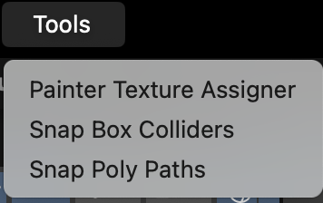
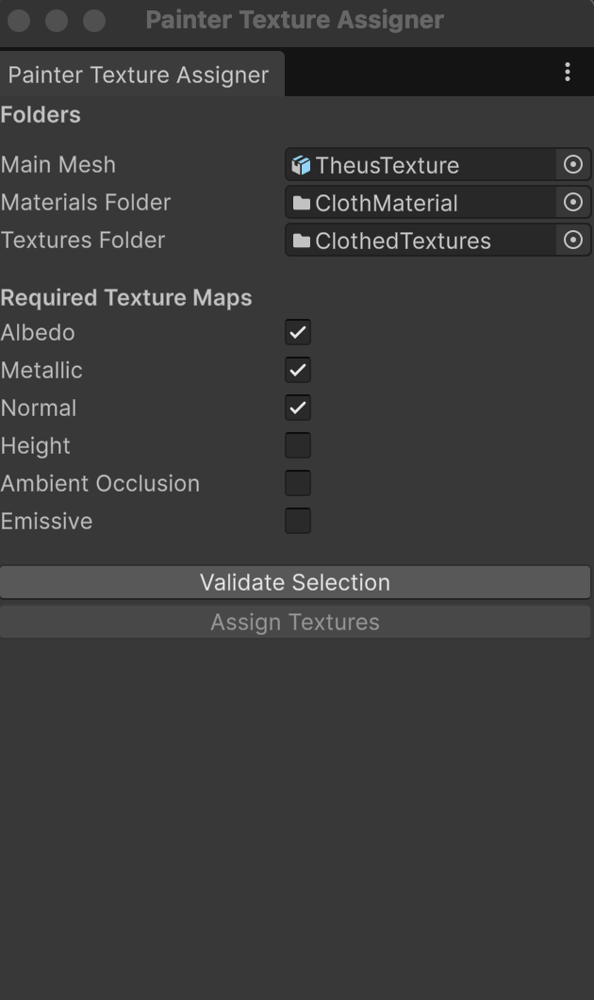
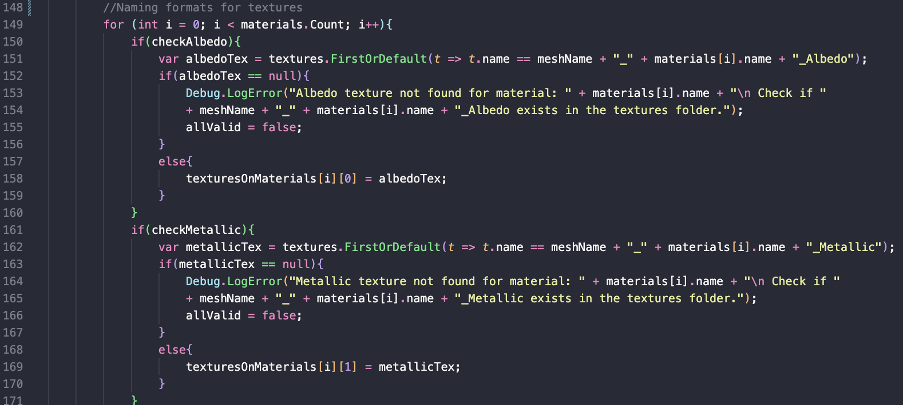
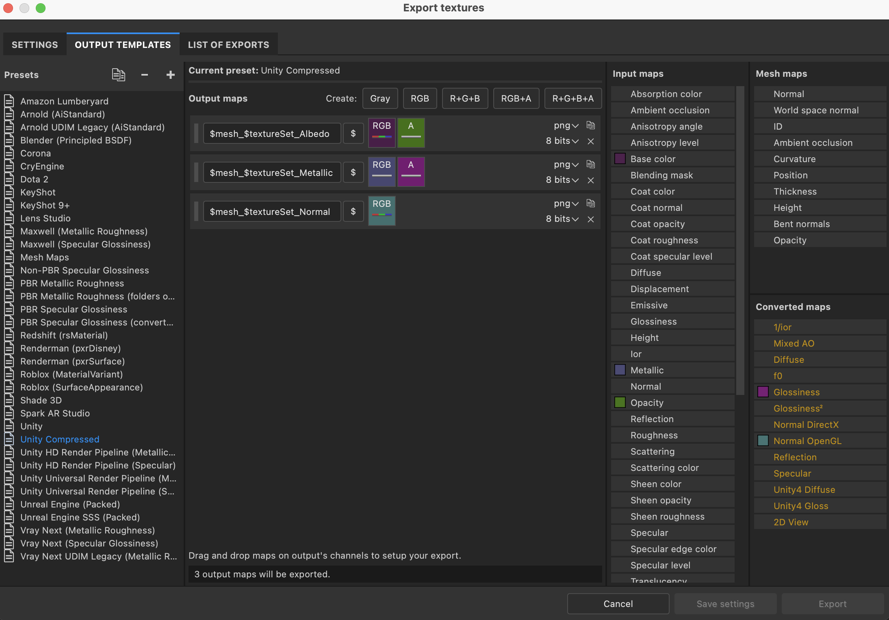

# PainterTextureAssigner
A simple tool that automatically assigns exported textures to their respective materials.

# How to use
1. Import the script into Unity; it will automatically create a new item named Painter Texture Assigner in the tool window. 

2. After opening the Painter Texture Assigner, assign the FBX model used for the material and assign two folders that contain extracted materials and exported textures. 
3. Select the options you want for textures using the checkboxes. Naming criteria for the texture options can be found on line 148 of the script. Make sure that the naming criteria are matched completely.   
4. Click Validate Selection. If the textures are not valid, check the debug log to see which textures are missing.  
5. If the textures are valid, the Assign Textures button becomes available; press on it to assign the textures.

# Other
Feel free to modify this script for personal use, but do not resell the script under any circumstances. This is a free-to-use tool.
If you want to thank me, feel free to tip me on [ko-fi](https://ko-fi.com/314programs).
